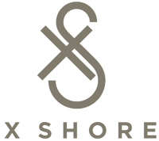

## X Shore AB (Sweden)
- *Researcher* | Apr'22 - Feb'23
- 
- Tags: Work
- Badges:
  - Badge [blue]
- List Items:
  - Developed a Mixed Integer Linear Programming MILP optimisation model to determine the optimal number of public (non-residential) fast and slow chargers needed to meet the charging demand of electric boats in Stockholm, Sweden
  - Code written in Python with Pyomo library and Gurobi solver

## Stutern Ltd (Nigeria)
- *Node.js Backend developer* | Jun'22 - Present
- 
- Tags: Work
- Badges:
  - Badge [blue]
- List Items:
  - PLed a team of 3 backend developers and also worked with 3 Frontend developers to re-develop a learning management platform to improve the learning experience of over 150 students yearly.
  - Developed a Movies rental REST API using Expressjs, MongoDB database and deployed to Render.

## Company 3
- *Role* | Mar'23 - Apr'23
- 
- Tags: Category 3
- Badges:
  - Badge [blue]
- List Items:
  - Point 1
  - Point 2
