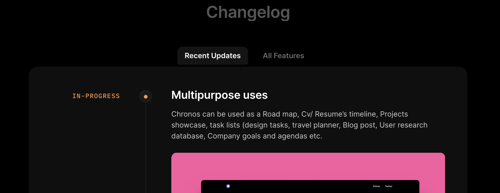
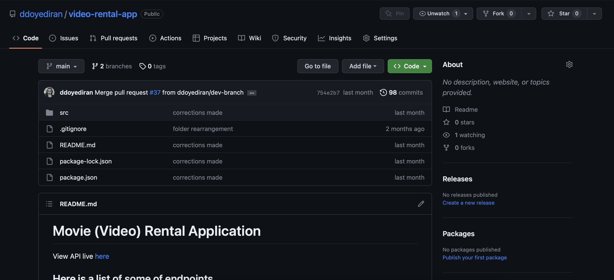

## ChangeLog REST API
Developed a ChangeLog App REST API that allows product managers to post updates about their product so users can see using Expressjs, PostgreSQL (Prisma), JsonWebToken (Authentication and Authorization), Bcrypt (Password hashing).
- 
- Tags: WebDev
- Badges:
  - Badge [blue]
- Buttons:
  - Live Site [https://change-log-api-z93y.onrender.com/]
  - GitHub Repo [https://github.com/ddoyediran/change_log_app]

## Movie Rental Application
A Movie Rental Application (REST API) where users can rent movies.
- 
- Tags: WebDev
- Badges:
  - Badge [blue]
- Buttons:
  - Live Site [https://video-rental-app.onrender.com/]
  - GitHub Repo [https://github.com/ddoyediran/video-rental-app]

## Project C
Description
- 
- Tags: Category 3
- Badges:
  - Badge [blue]
- Buttons:
  - Link [https://example.com]
