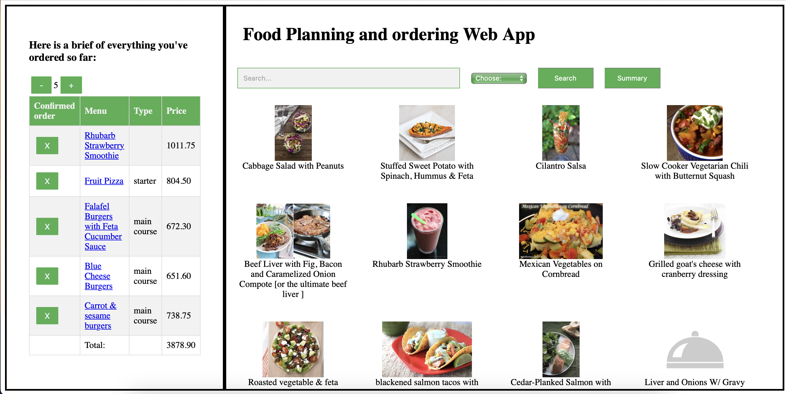

## ChangeLog REST API
Developed a ChangeLog App REST API that allows product managers to post updates about their product so users can see using Expressjs, PostgreSQL (Prisma), JsonWebToken (Authentication and Authorization), Bcrypt (Password hashing).
- 
- Tags: WebDev
- Badges:
  - Expressjs [blue]
  - PostgreSQL [blue]
  - Prisma [blue]
  - JsonWebToken [blue]
  - Bcrypt [blue]
- Buttons:
  - Live Site [https://change-log-api-z93y.onrender.com/]
  - GitHub Repo [https://github.com/ddoyediran/change_log_app]

## Movies Rental Application
A Movie Rental Application (REST API) where users can rent movies.
- 
- Tags: WebDev
- Badges:
  - Expressjs [blue]
  - Nodejs [blue]
  - JOI [blue]
  - MongoDB [blue]
  - Mongoose [blue]
- Buttons:
  - Live Site [https://video-rental-app.onrender.com/]
  - GitHub Repo [https://github.com/ddoyediran/video-rental-app]

## Dinner planner web app
Built a dinner planner web app integrating Spoonacular API where users can search dishes, see details of the dish and also get ingredient list for each dish using React js, Firebase with Model View Presenter pattern.
- 
- Tags: WebDev
- Badges:
  - React [blue]
  - Vue [blue]
  - HTML [blue]
  - CSS [blue]
  - Firebase [blue]
- Buttons:
  - Link [#]
